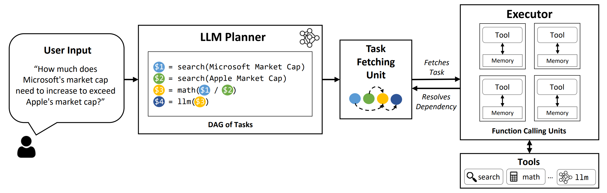

# LLMCompiler: An LLM Compiler for Parallel Function Calling [[Paper](https://arxiv.org/abs/2312.04511)]



**LLMCompiler** is a framework that enables an _efficient and effective orchestration of parallel function calling_ with LLMs, including both open-source and close-source models, by automatically identifying which tasks can be performed in parallel and which ones are interdependent.


**TL;DR:**
The reasoning capabilities of LLMs enable them to execute multiple function calls, using user-provided functions to overcome
their inherent limitations (e.g. knowledge cutoffs, poor arithmetic skills, or lack of access to private data).
While multi-function calling allows them to tackle more complex problems, 
current methods often require sequential reasoning and acting for each function which can result
in high latency, cost, and sometimes inaccurate behavior.
LLMCompiler addresses this by decomposing problems into multiple tasks 
that can be executed in parallel, thereby efficiently orchestrating multi-function calling.
With LLMCompiler, the user specifies the tools
along with optional in-context examples, and **LLMCompiler automatically computes an optimized orchestration for
the function calls**.
LLMCompiler can be used with open-source models such as LLaMA, as well as OpenAI’s GPT models.
Across a range of tasks that exhibit different patterns of parallel function calling, LLMCompiler 
consistently demonstrated **latency speedup, cost saving, and accuracy improvement**.
For more details, please check out our [paper](https://arxiv.org/abs/2312.04511).


---
## Installation

1. Create a conda environment and install the dependencies
```
conda create --name llmcompiler python=3.10 -y
conda activate llmcompiler
```

2. Clone and install the dependencies
```
git clone https://github.com/SqueezeAILab/LLMCompiler
cd LLMCompiler
pip install -r requirements.txt
```

---
## Basic Runs
To reproduce the evaluation results in the paper, run the following command:
```
python run_llm_compiler.py --api_key {openai-api-key} --benchmark {benchmark-name} --store {store-path} [--logging] [--stream]
```

* `--api_key`: OpenAI API Key
* `--benchmark`: Benchmark name. Use `hotpotqa`, `movie`, and `parallelqa` to evaluate LLMCompiler on the HotpotQA, Movie Recommendation, and ParallelQA benchmarks, respectively.
* `--store`: Path to save the result. Question, true label, prediction, and latency per example will be stored in a JSON format.
* `--logging`: (Optional) Enables logging.
* `--stream`: (Optional, Recommended) Enables streaming. It improves latency by streaming out tasks from the Planner to the Task Fetching Unit and Executor immediately after their generation, rather than blocking the Executor until all the tasks are generated from the Planner.

After the run is over, you can get the summary of the results by running the following command:
```
python evaluate_results.py --file {store-path}
```

---
## Adding Your Custom Benchmark
To use LLMCompiler on your custom benchmarks or use cases, 
you only need to provide the functions and their descriptions, as well as example prompts.
Please refer to `configs/hotpotqa`, `configs/movie`, and `configs/parallelqa` as examples. 

* `gpt_prompts.py`: Defines in-context example prompts
* `tools.py`: Defines functions (i.e. tools) to use, and their descriptions (i.e. instructions and arguments) 


---
## Roadmap
We are planning to update the following features soon:
* Support for open-source models (e.g. LLaMA-2)
* Baseline methods we used in the paper
* Tree-of-Thoughts evaluation we used in the paper

---
## Citation

LLMCompiler has been developed as part of the following paper. We appreciate it if you would please cite the following paper if you found the library useful for your work:

```
@article{kim2023llmcompiler,
  title={An LLM Compiler for Parallel Function Calling},
  author={Kim, Sehoon and Moon, Suhong and Tabrizi, Ryan and Lee, Nicholas and Mahoney, Michael and Keutzer, Kurt and Gholami, Amir},
  journal={arXiv},
  year={2023}
}
```

